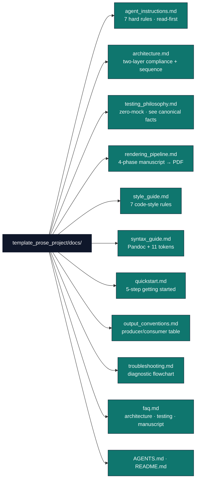

# `template_prose_project/docs/`

Documentation hub for the prose-review exemplar.



## Quick links

| File | Purpose |
|---|---|
| [`agent_instructions.md`](agent_instructions.md) | 7 hard rules for AI agents; verification checklist. |
| [`architecture.md`](architecture.md) | Two-layer compliance and data-flow diagrams. |
| [`testing_philosophy.md`](testing_philosophy.md) | Zero-mock standard; measured test count and coverage live in the repo canonical facts. |
| [`rendering_pipeline.md`](rendering_pipeline.md) | Four phases of the manuscript → PDF flow; `config.yaml` controls. |
| [`style_guide.md`](style_guide.md) | 7 code-style rules (Zero-Mock, Infrastructure Delegation, Thin Orchestrator, Show-Not-Tell, Explicit Paths, Type Hints, Error Messages). |
| [`syntax_guide.md`](syntax_guide.md) | Pandoc-crossref `[@sec:…]`, all eleven `{{TOKEN}}`s, code blocks. |
| [`quickstart.md`](quickstart.md) | 5-step getting-started flow. |
| [`output_conventions.md`](output_conventions.md) | Where every artefact lands on disk. |
| [`troubleshooting.md`](troubleshooting.md) | Diagnostic flowchart for common failures. |
| [`faq.md`](faq.md) | Recurring questions about architecture, testing, manuscript. |
| [`AGENTS.md`](AGENTS.md) | Agent-oriented walkthrough of this hub (read-first reference). |

## Audience-targeted entry points

* **First-time agent on this project** → start with
  [`agent_instructions.md`](agent_instructions.md), then
  [`architecture.md`](architecture.md).
* **Modifying `src/` or `tests/`** → [`style_guide.md`](style_guide.md)
  + [`testing_philosophy.md`](testing_philosophy.md).
* **Editing manuscript prose** → [`syntax_guide.md`](syntax_guide.md)
  + [`../manuscript/SYNTAX.md`](../manuscript/SYNTAX.md).
* **Running the full pipeline** → [`quickstart.md`](quickstart.md)
  + [`rendering_pipeline.md`](rendering_pipeline.md).
* **A check or stage failed** → [`troubleshooting.md`](troubleshooting.md)
  + [`faq.md`](faq.md).
* **Understanding what lands in `output/`** →
  [`output_conventions.md`](output_conventions.md).

## Using this exemplar as a reference for a new project

`template_prose_project` is a **canonical, always-present reference** (root
`CLAUDE.md`/`AGENTS.md`). Use it two ways:

**1. As a pattern reference (read, don't copy).** Mirror these invariants —
they are what the repo's gates enforce:

| Invariant | Where it's taught | How it's enforced |
|---|---|---|
| Thin-orchestrator: only `src/pipeline/` touches `infrastructure/`; `scripts/` are CLI shims | [`architecture.md`](architecture.md), [`style_guide.md`](style_guide.md) | code review + `src/` infra-import grep |
| Zero mocks: real Markdown + real BibTeX in `tmp_path` | [`testing_philosophy.md`](testing_philosophy.md) | `scripts/audit/verify_no_mocks.py` |
| ≥90% project coverage on `src/` (live % → [`COUNTS.md`](../../../../docs/_generated/COUNTS.md)) | [`testing_philosophy.md`](testing_philosophy.md) | `--cov-fail-under=90` (canonical command below) |
| `manuscript/config.yaml` is the single source of run policy | [`rendering_pipeline.md`](rendering_pipeline.md) | the prose pipeline |
| `references.bib` hand-curated, read-only (validated, never written) | [`../manuscript/AGENTS.md`](../manuscript/AGENTS.md) | bibliography checks |

**2. As a fork seed for a new prose/review project:**

```bash
NEW=my_review_project
uv run python scripts/audit/copy_exemplar.py \
  --source templates/template_prose_project \
  --dest "projects/working/$NEW" \
  --new-name "$NEW"
cd "projects/working/$NEW"
# 1. Edit manuscript/config.yaml (title, thresholds, bibliography policy) — the only knob
# 2. Replace manuscript/*.md with your prose; keep H1-per-section + {{TOKEN}} conventions
# 3. Curate manuscript/references.bib (validated, never auto-written)
# 4. Adjust src/ only if you need new checks — keep pipeline/ as the sole infra seam
uv run pytest "projects/working/$NEW/tests/" --cov="projects/working/$NEW/src" --cov-fail-under=90
uv run python scripts/runner/execute_pipeline.py --project "working/$NEW" --core-only
```

Because the copied tree already has `src/` Python files and `tests/`, the
project is then auto-discovered; the repo-level
[`docs/guides/new-project-setup.md`](../../../../docs/guides/new-project-setup.md)
covers the full workflow.

**Prerequisites before referencing the render path:** this manuscript embeds
Mermaid (`manuscript/05_pipeline_internals.md`), so combined-PDF rendering
needs `chrome-headless-shell`
(`npx --yes puppeteer browsers install chrome-headless-shell`); the
authoritative test gate is the **direct** command below (a green
`01_run_tests.py` exit with 0 collected tests is not a pass). See
[`troubleshooting.md`](troubleshooting.md) and
[`rendering_pipeline.md`](rendering_pipeline.md).

**Prose vs. code — pick the right reference.** Use
**`template_prose_project`** when the deliverable is editorial
(readability / structure / citation review of written prose). Use the sibling
**[`template_code_project`](../../template_code_project/)** when the
deliverable is computed (algorithms, data figures, numerical results). Both
share the identical structural contract above.

## See also

* Project [`README.md`](../README.md) — top-level project overview.
* Project [`AGENTS.md`](../AGENTS.md) — agent walkthrough.
* [`../manuscript/SYNTAX.md`](../manuscript/SYNTAX.md) — Pandoc citation/cross-reference syntax.
* [`../../../infrastructure/prose/SKILL.md`](../../../../infrastructure/prose/SKILL.md) — underlying analysis API.
* [`../../../infrastructure/reference/SKILL.md`](../../../../infrastructure/reference/SKILL.md) — bibliography validation API.
