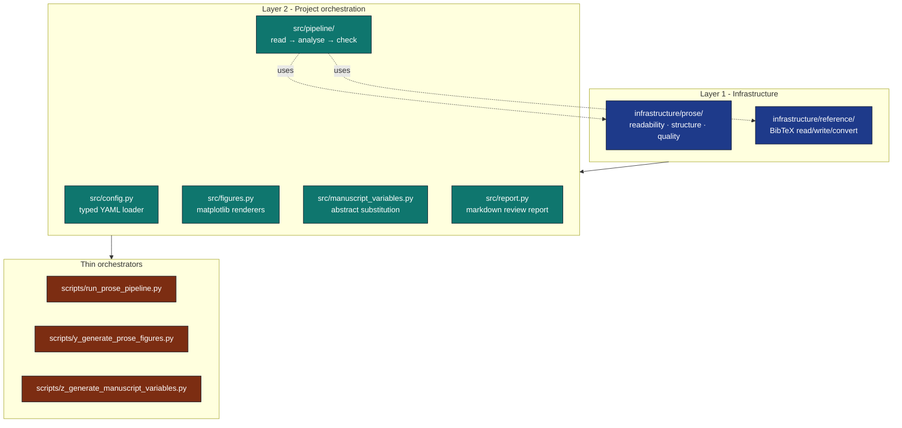
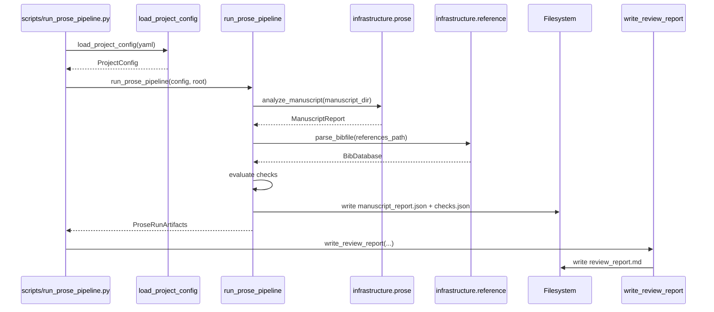

# Architecture

## Two-Layer Compliance

## Data flow

## Why These Exemplar Shapes?

The permanent `template_*` exemplars cover the always-on computational,
prose-review, and literature-discovery paths:

| Project | Workflow | Algorithm? | Mutates `references.bib`? |
|---|---|---|---|
| `template_code_project` | Numerical experiment + analysis | yes (`src/optimizer.py`) | no |
| `template_prose_project` | Editorial review (readability + structure + bibliography) | no | no (read-only validation) |
| `template_search_project` | Literature discovery → BibTeX → LLM synthesis | no | yes (auto-populates) |

The infrastructure modules are deliberately small and stable; each
exemplar is small and explicit. New projects pick whichever shape is
closest and adjust from there.
