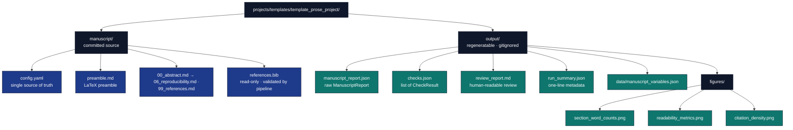

# Output Conventions

Every artefact has a fixed location, a fixed producer, and a documented
consumer. This file is the single source of truth for that mapping.

## Tree

## Producer / consumer table

| Artefact | Produced by | Consumed by |
|---|---|---|
| `output/manuscript_report.json` | `run_prose_pipeline.py` (calls `infrastructure.prose.write_report`) | `y_generate_prose_figures.py`, `z_generate_manuscript_variables.py` |
| `output/checks.json` | `run_prose_pipeline.py` (`pipeline.run_prose_pipeline` writes `[CheckResult.to_dict()]`) | CI gates, `review_report.md` builder |
| `output/review_report.md` | `run_prose_pipeline.py` (`src.report.write_review_report`) | humans |
| `output/run_summary.json` | `run_prose_pipeline.py` | downstream tooling |
| `output/data/manuscript_variables.json` | `z_generate_manuscript_variables.py` | rendering (substituted into markdown) |
| `output/figures/*.png` | `y_generate_prose_figures.py` | manuscript via `infrastructure.documentation.FigureManager` |
| `manuscript/references.bib` | **NOT** modified by this pipeline (read-only) | `pipeline/` cross-checks against it |

## Conventions

* **Stable filenames.** Every output file has a fixed name; downstream
  consumers never need globbing.
* **JSON for state, Markdown for narrative.** State files are pretty-printed
  JSON for greppability; narrative files are CommonMark Markdown.
* **No timestamps in filenames.** Stable across runs so diffs are
  meaningful.
* **PNG only for figures.** 300 dpi, colour-blind-safe palette, PNG-only
  for archival stability.
* **`output/` is gitignored.** Everything in it is regenerable from
  `manuscript/` + `manuscript/config.yaml`.
* **`manuscript/references.bib` is read-only here.** The prose project
  *validates* citations; it never writes to the bib file. Contrast with
  the optional `projects/archive/template_search_project` add-on, which
  auto-populates it.
