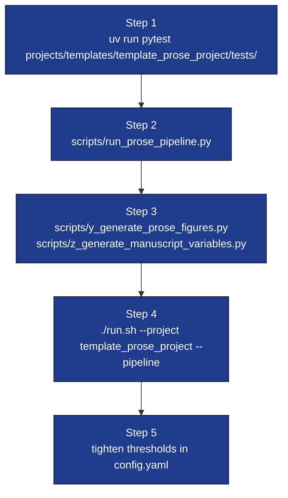

# Quickstart



## 1. Smoke-test in 5 seconds

```bash
uv run pytest projects/templates/template_prose_project/tests/ -q
```

All tests should pass without an internet connection.

## 2. Run the orchestrator

```bash
uv run python projects/templates/template_prose_project/scripts/run_prose_pipeline.py
```

Reads `manuscript/config.yaml`, runs prose analysis on
`manuscript/*.md`, validates `manuscript/references.bib`, and writes:

* `output/manuscript_report.json`
* `output/checks.json`
* `output/review_report.md`
* `output/run_summary.json`

## 3. Generate figures + variables

```bash
uv run python projects/templates/template_prose_project/scripts/y_generate_prose_figures.py
uv run python projects/templates/template_prose_project/scripts/z_generate_manuscript_variables.py
```

Outputs:

* `output/figures/section_word_counts.png`
* `output/figures/readability_metrics.png`
* `output/figures/citation_density.png`
* `output/data/manuscript_variables.json`

## 4. Run under the full pipeline

```bash
./run.sh --project template_prose_project --pipeline
```

The infrastructure pipeline runner cleans `output/`, runs tests,
executes every `scripts/*.py` (alphabetical: `run_prose_pipeline.py`,
`y_generate_prose_figures.py`, `z_generate_manuscript_variables.py`),
renders the PDF with Pandoc, and validates outputs.

## 5. Tighten thresholds

To enforce a stricter grade-level band:

```yaml
prose:
  target_grade_level_min: 12.0
  target_grade_level_max: 16.0
  citation_density_min_per_1000: 8.0
```

Then run with `--strict`:

```bash
uv run python projects/templates/template_prose_project/scripts/run_prose_pipeline.py --strict
```

The script exits non-zero if any check fails — perfect for CI.
