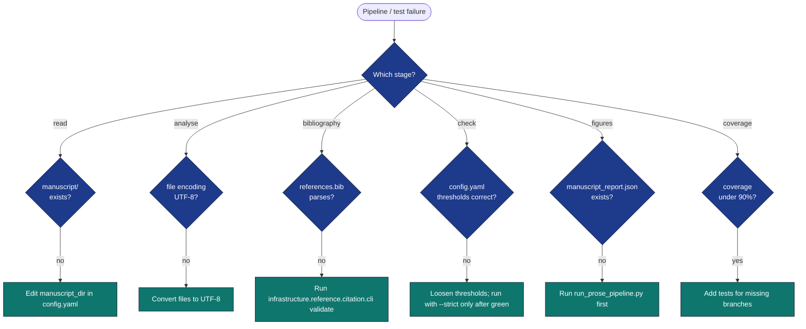

# Troubleshooting

## Diagnostic flow



## Common failures

### "Pipeline failed in `every_file_has_h1`"

**Symptom:** `output/checks.json` shows `every_file_has_h1` failed with
a list of files that do not start with `#`.

**Fixes:**

1. Each file under `manuscript/` must begin with a top-level heading
   (`# Title`). Add an H1 to the offending file.
2. If the file is intentionally H1-less (e.g. front-matter-only),
   exclude it via the `exclude_filenames` argument to
   `infrastructure.prose.read_manuscript_dir` — but typically the right
   fix is to add the H1.
3. Or set `prose.require_h1_per_section: false` in `manuscript/config.yaml`
   (loosens the policy globally).

### "Bibliography consistency failed: missing keys"

**Symptom:** `bibliography_consistency` failed; `details.missing` lists
`[@key]` references in the prose that do not appear in `references.bib`.

**Fixes:**

1. Add the missing entries to `manuscript/references.bib` (this project
   never writes to the bib — manual curation is intentional).
2. Or remove the offending `[@key]` from the prose if the citation was
   speculative.
3. Or set `bibliography.fail_on_missing: false` in `config.yaml` to
   warn rather than fail.

### "Grade level out of band"

**Symptom:** `grade_level_in_band` failed; FKGL is outside
`[target_grade_level_min, target_grade_level_max]`.

**Fixes:**

1. **Too high (dense prose):** shorten sentences, replace polysyllabic
   words with simpler synonyms, split paragraphs.
2. **Too low (over-simple):** verify `manuscript/` contains the actual
   prose, not placeholder text. The default min of 10.0 corresponds to
   roughly mid-secondary-school reading; below that suggests stub
   content.
3. Or widen the band in `config.yaml`.

### "Figures missing"

**Symptom:** `output/figures/` is empty after a run.

**Fixes:**

1. `output/manuscript_report.json` does not exist — the figure stage
   exits 2 when there's no input. Run `run_prose_pipeline.py` first.
2. Matplotlib backend issue — the figure module sets `MPLBACKEND=Agg`
   automatically; verify that environment variable is not being
   overridden by the shell.

### "Coverage below 90%"

**Symptom:** `uv run pytest projects/templates/template_prose_project/tests/` exits with
"coverage below 90".

**Fixes:**

* Add tests for branches reported in the coverage output.
* Untested code in `src/` is the most common cause; `scripts/` is *not*
  in the coverage source tree.

### "ImportPathMismatchError when running tests"

**Symptom:**
```
_pytest.pathlib.ImportPathMismatchError: ('tests.conftest', ...)
```
when running `uv run pytest tests/ projects/templates/template_prose_project/tests/` together.

**Cause:** Both directories are named `tests/` and pytest's import path
discovery confuses them.

**Fix:** Run them separately. The infrastructure pipeline always invokes
them in separate subprocess calls so this only affects ad-hoc usage.

### "PDF Rendering stage fails: `mmdc` could not find Chrome"

**Symptom:** The pipeline reaches **PDF Rendering** and fails (authoritative
`output/reports/pipeline_report.json` shows `"PDF Rendering" -> failed`),
even though Project Tests, Analysis, and the per-section slide PDFs all
passed. The error contains:

```
❌ Rendering error generating combined PDF: mmdc failed for
inline_mermaid_0001_...: Error: Could not find Chrome (ver. 131.0.6778.204).
```

**Cause:** This manuscript embeds **Mermaid** diagrams (e.g.
`manuscript/05_pipeline_internals.md`). The combined-PDF render shells out to
`mmdc` (mermaid-cli), which renders each diagram with a **pinned**
`chrome-headless-shell`. If that exact build is not in the Puppeteer cache,
the combined PDF — and therefore the whole PDF Rendering stage — fails. The
per-section slide PDFs still succeed because they do not invoke `mmdc`.

**Fix:** install the pinned headless Chrome once (reversible; lands in
`~/.cache/puppeteer/`):

```bash
# Install the version mmdc reports as missing (read the version from the error)
npx --yes puppeteer browsers install chrome-headless-shell@131.0.6778.204
# or simply the latest line mmdc/puppeteer resolves:
npx --yes puppeteer browsers install chrome-headless-shell
```

Then re-run only the render stage to confirm:

```bash
uv run python scripts/pipeline/stage_03_render.py --project template_prose_project
# expect: "✅ Generated combined PDF: template_prose_project_combined.pdf"
```

**Note:** this is an *environment provisioning* requirement, not a manuscript
defect. CI provisions `chrome-headless-shell`; a fresh local clone does not.
Any project whose manuscript contains a ```mermaid``` block inherits this
prerequisite — see [rendering_pipeline.md](rendering_pipeline.md#prerequisite-mermaid-diagrams-need-chrome-headless-shell).

### "Tests report PASSED but ran 0 tests / 0.0% coverage"

**Symptom:** `scripts/pipeline/stage_01_test.py --project template_prose_project`
prints `Project: ✓ PASSED (0/0 tests, 0.0% coverage)` and exits 0, while the
documented direct command runs all tests at full coverage.

**Cause:** the aggregate runner resolves the project interpreter from
`projects/templates/template_prose_project/.venv`. If that venv exists but lacks
`pytest`/`pytest-cov` (created by `uv venv` without `uv sync`), pytest
collects nothing. A green exit with **zero collected tests is not a pass.**

**Fixes:**

1. Run the **canonical per-project gate** directly — this is the real
   quality gate (it always uses the workspace interpreter and the repo-root
   coverage config):
   ```bash
   uv run pytest projects/templates/template_prose_project/tests/ \
     --cov=projects/templates/template_prose_project/src --cov-fail-under=90
   ```
2. Or `uv sync` so the per-project `.venv` has the test deps.
3. Always verify the run **collected > 0 tests AND coverage ≥ 90%** — exit
   code 0 alone is insufficient. (The current runner now falls back to the
   workspace interpreter and hard-fails a 0-collected or below-threshold run;
   the direct command above is still the authoritative gate.)

**Coverage-config note:** the project's own `pyproject.toml`
`[tool.coverage]` uses *project-relative* `source`/`omit` paths that do not
resolve when pytest runs from the repo root. The canonical command and the
runner both measure against the **repo-root** `pyproject.toml` coverage
config — that is the number the 90% gate enforces (live % →
[`docs/_generated/COUNTS.md`](../../../../docs/_generated/COUNTS.md)).

## Where to look

* `output/checks.json` — every check's pass/fail with `details` payload.
* `output/manuscript_report.json` — full per-file metrics.
* `output/run_summary.json` — one-line summary.
* `output/review_report.md` — human-readable narrative of all the above.
