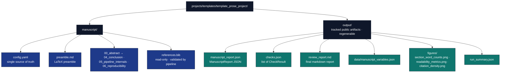
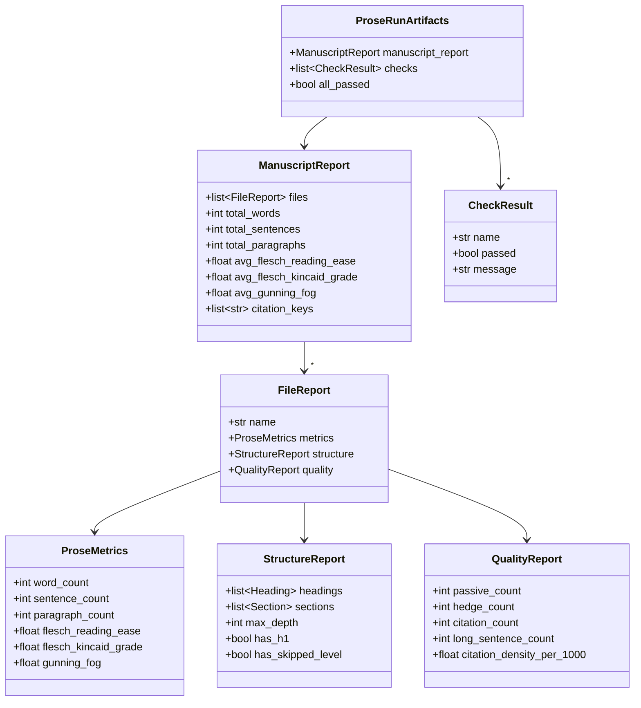

# Pipeline Internals {#sec:pipeline_internals}

This section documents the artefacts produced by the prose-review run.

```mermaid
flowchart TB
    P[projects/templates/template_prose_project/]
    P --> M[manuscript/]
    P --> OUT[output/<br/>tracked public artifacts · regenerable]

    M --> M_CFG[config.yaml<br/>single source of truth]
    M --> M_PRE[preamble.md<br/>LaTeX preamble]
    M --> M_SEC[00_abstract → 04_conclusion ·<br/>05_pipeline_internals · 06_reproducibility]
    M --> M_BIB[references.bib<br/>read-only · validated by pipeline]

    OUT --> O_REP[manuscript_report.json<br/>ManuscriptReport JSON]
    OUT --> O_CK[checks.json<br/>list of CheckResult]
    OUT --> O_RR[review_report.md<br/>final markdown report]
    OUT --> O_DATA[data/manuscript_variables.json]
    OUT --> O_FIG[figures/<br/>section_word_counts.png ·<br/>readability_metrics.png ·<br/>citation_density.png]
    OUT --> O_RS[run_summary.json]

    classDef d fill:#0f172a,stroke:#0f172a,color:#fff
    classDef src fill:#1e3a8a,stroke:#0f172a,color:#fff
    classDef gen fill:#0f766e,stroke:#0f172a,color:#fff
    class P,M,OUT d
    class M_CFG,M_PRE,M_SEC,M_BIB src
    class O_REP,O_CK,O_RR,O_DATA,O_FIG,O_RS gen
```

## Data structures

```mermaid
classDiagram
    class ManuscriptReport {
        +list~FileReport~ files
        +int total_words
        +int total_sentences
        +int total_paragraphs
        +float avg_flesch_reading_ease
        +float avg_flesch_kincaid_grade
        +float avg_gunning_fog
        +list~str~ citation_keys
    }

    class FileReport {
        +str name
        +ProseMetrics metrics
        +StructureReport structure
        +QualityReport quality
    }

    class ProseMetrics {
        +int word_count
        +int sentence_count
        +int paragraph_count
        +float flesch_reading_ease
        +float flesch_kincaid_grade
        +float gunning_fog
    }

    class StructureReport {
        +list~Heading~ headings
        +list~Section~ sections
        +int max_depth
        +bool has_h1
        +bool has_skipped_level
    }

    class QualityReport {
        +int passive_count
        +int hedge_count
        +int citation_count
        +int long_sentence_count
        +float citation_density_per_1000
    }

    class CheckResult {
        +str name
        +bool passed
        +str message
    }

    class ProseRunArtifacts {
        +ManuscriptReport manuscript_report
        +list~CheckResult~ checks
        +bool all_passed
    }

    ManuscriptReport --> "*" FileReport
    FileReport --> ProseMetrics
    FileReport --> StructureReport
    FileReport --> QualityReport
    ProseRunArtifacts --> ManuscriptReport
    ProseRunArtifacts --> "*" CheckResult
```
