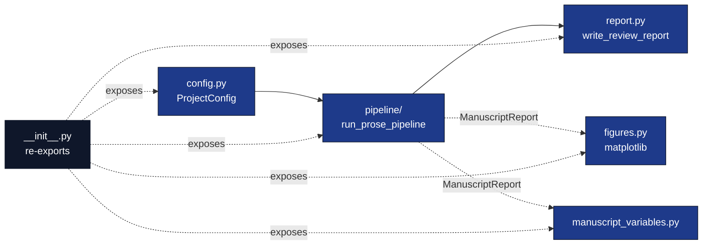

# `template_prose_project/src/`

Domain orchestration for the prose-review pipeline.

## Purpose

Layer-2 code: pure orchestration over `infrastructure/prose/` and
`infrastructure/reference/citation/`. Contains no novel algorithm of
its own — its job is to wire the infrastructure modules to the
manuscript directory and the project's configuration.

## Files

| File | Role |
|---|---|
| `__init__.py` | Public re-exports. |
| `config.py` | `ProjectConfig` typed YAML loader (`ProseAnalysisConfig`, `BibliographyConfig`, `ReportConfig`). |
| `pipeline/` | `run_prose_pipeline` plus `pipeline/checks.py` (`CHECK_REGISTRY`) — read manuscript, analyse, cross-check bib, evaluate checks, write JSON. |
| `figures.py` | `plot_section_word_counts`, `plot_readability_metrics`, `plot_citation_density`, `generate_all_figures`. Scripts load typed reports via `infrastructure.prose.report.load_report_json`. |
| `manuscript_variables.py` | `load_report_payload`, `compute_variables`, `substitute_in_text`, `write_variables` for abstract substitution. |
| `report.py` | `write_review_report` — assemble the markdown review. |

## Module graph

## Invariants

* **Only `pipeline/` touches `infrastructure.prose.*` or
  `infrastructure.reference.citation.*`.** Other modules stay framework-free.
* **No I/O outside `pipeline/__init__.py`'s `write_outputs=True` branch and
  `figures.py`/`manuscript_variables.py`/`report.py`'s explicit write
  helpers.** Tests must be able to drive the logic without touching the
  filesystem.
* **`run_prose_pipeline` returns a `ProseRunArtifacts` dataclass.**
  The script reads paths off this dataclass; nothing should re-derive
  filesystem layouts.
* **All configuration flows through `ProjectConfig`.** Adding a new check
  means: add a field → parse it in `from_dict` → wire it into
  `run_prose_pipeline`.

## Editing checklist

- [ ] Added a new check → add field to `ProseAnalysisConfig`, parse in
  `from_dict`, add `_check_<name>` to `pipeline/checks.py`, append to the
  checks list, add a test in `tests/test_pipeline.py`.
- [ ] Added a new figure → add `plot_<name>(report, output_dir) -> Path`
  in `figures.py`, append to `generate_all_figures`, add a test in
  `tests/test_figures.py`.
- [ ] Changed report layout → re-run `tests/test_report.py` and verify
  `tests/test_pipeline_integration.py` still produces the expected
  signposts.
- [ ] Added a substitution variable → add field to
  `ManuscriptVariables`, populate in `compute_variables`, add a test in
  `tests/test_manuscript_variables.py`, reference the new
  `{{UPPER_NAME}}` marker in `manuscript/00_abstract.md`.

## See also

* [`README.md`](README.md) — quick reference.
* [`../AGENTS.md`](../AGENTS.md) — project-level agent guide.
* [`../docs/architecture.md`](../docs/architecture.md) — architectural diagram.
