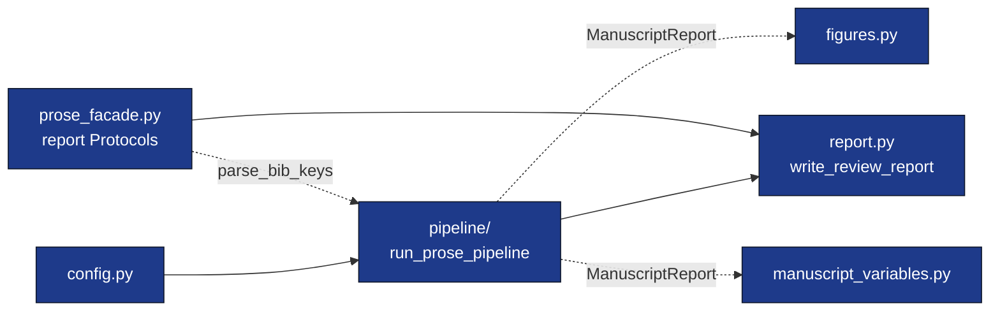

# `template_prose_project/src/`

Domain orchestration: pure functions over `infrastructure/prose/` and
`infrastructure/reference/`.



## Quick start

```python
from template_prose_project.src import (
    load_project_config,
    run_prose_pipeline,
    write_review_report,
)

config = load_project_config("manuscript/config.yaml")
artifacts = run_prose_pipeline(config, project_root=".")

write_review_report(
    "output/review_report.md",
    title=config.title,
    manuscript_report=artifacts.manuscript_report,
    checks=artifacts.checks,
)
```

## Modules

| Module | Public exports |
|---|---|
| `config.py` | `ProjectConfig`, `ProseAnalysisConfig`, `BibliographyConfig`, `ReportConfig`, `load_project_config`. |
| `pipeline/` | `run_prose_pipeline`, `ProseRunArtifacts`, `CheckResult`, and configured check functions. |
| `figures.py` | `plot_section_word_counts`, `plot_readability_metrics`, `plot_citation_density`, `generate_all_figures`. |
| `manuscript_variables.py` | `ManuscriptVariables`, `load_report_payload`, `compute_variables`, `substitute_in_text`, `write_variables`. |
| `report.py` | `write_review_report`. |
| `prose_facade.py` | `ManuscriptReportLike`, `FileReportLike`, `ProseMetricsLike`, `QualityReportLike`, `StructureReportLike`, `render_outline`, `parse_bib_keys`. |

See [AGENTS.md](AGENTS.md) for invariants and the editing checklist.
