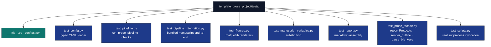

# `template_prose_project/tests/`

Test-suite agent guide.

## Layout



## Conventions

* **No mocks.** Every test uses real prose strings, real `tmp_path`
  files, real BibTeX content, and (for `test_scripts.py`) real
  `subprocess.run` calls.
* **`tmp_path` fixture for filesystem isolation.** Tests never write to
  the project's own `output/` directory.
* **Bundled manuscript is the integration fixture.** `test_pipeline_integration.py`
  copies `manuscript/` to a temp dir and runs the whole pipeline against it.
* **Coverage gate: 90%.** Measured coverage → [`docs/_generated/COUNTS.md`](../../../../docs/_generated/COUNTS.md); reductions should be justified in the PR.

## Running

```bash
# Full suite
uv run pytest projects/templates/template_prose_project/tests/ -v

# With coverage gate
uv run pytest projects/templates/template_prose_project/tests/ \
    --cov=projects/templates/template_prose_project/src \
    --cov-fail-under=90

# A single test
uv run pytest projects/templates/template_prose_project/tests/test_pipeline.py::TestRunProsePipeline::test_passing_run -v
```

## Editing rules

* **Tests mirror src.** A new function in `src/<x>.py` deserves a class
  in `tests/test_<x>.py`.
* **Real bibliographies in tests.** When testing the bibliography
  cross-check, write a real (small) `.bib` file rather than constructing
  `BibDatabase` objects directly — this catches parser-level breakage.
* **Subprocess tests live in `test_scripts.py`.** Direct `main()` calls
  belong in script-specific test modules; subprocess tests belong here.

## See also

* [`README.md`](README.md) — quick reference.
* [`../docs/troubleshooting.md`](../docs/troubleshooting.md) — when
  things break.
